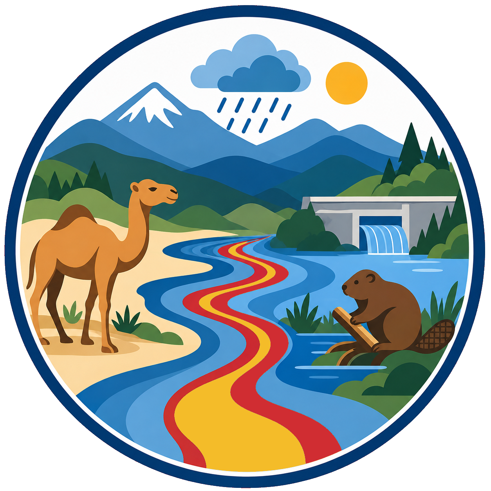
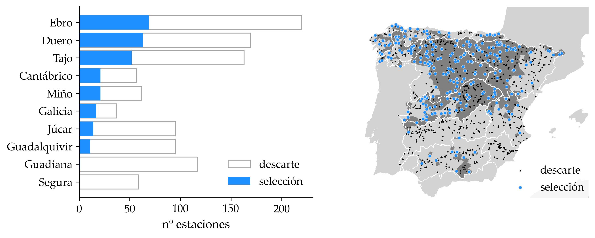

<p align="center">
  
</p>

<h1 align="center">Of Camels and Beavers - Spain</h1>

<p align="center">
  <a href="https://www.python.org/"></a>
  <a href="https://www.gnu.org/licenses/gpl-3.0"></a>
  <a href="https://github.com/casadoj/of_camels_and_beavers/wiki"></a>
</p>

<!-- <table>
  <tr>
    <td width="200" align="center">
      
    </td>
    <td>
      <h1>Of Camels and Beavers - Spain</h1>
      <p>
        
        <a href="https://www.gnu.org/licenses/gpl-3.0"></a>
        <a href="https://github.com/casadoj/of_camels_and_beavers/wiki"></a>
      </p>
    </td>
  </tr>
</table> -->

## Introduction

This repository creates two dataset representing the natural and regulated Hydrology in Spain.

1. **CAMELS-ES** (*Catchment Attributes and Meteorology for Large-Sample Studies – Spain*): daily time series of river streamflow and catchment meteorology, and catchment characteristics for gauging stations in natural or semi-natural regime.
2. **BEAVERS-ES** (*Basin and rEservoir Attributes, Volume, Evaporation and Release time Series – Spain*): daily timeseries of reservoir operations (inflow, outflow and storage) and catchment meteorology, and catchment and reservoir characteristics.

The purpose of these two datasets is to build deep-learning models that represent either natural or regulated catchments over the country. CAMELS-ES is part of the [CARAVAN](https://github.com/kratzert/Caravan) initiative, that aims at creating a large dataset of hydrological time series to build large-sample hydrological models. BEAVERS-ES follows that phylosophy, but aims at creating a large dataset of reservoir operations; similar datasets have already been published for the US ([ResOpsUS+CARS](https://zenodo.org/records/15978041)) and Brazil ([ResOpsBR+CARS](https://zenodo.org/records/16096623)).

Both datasets will be published freely on Zenodo to enhance model intercomparison.

<p align="center">
  <a href="https://doi.org/10.4995/ia.25084">
    
  </a>
  <br>
  <em><b>Figure 1:</b> Selection of gauging stations in CAMELS-ES v1.</em>
</p>

## Data sources

The dataests integrate high-quality local and continental producs:
* **Hydrology**: [*Anuario de aforos 2020-2021*](https://ceh.cedex.es/anuarioaforos/default.asp) (CEDEX).
* **Meteorology**: [*EMO1*](https://data.jrc.ec.europa.eu/dataset/0bd84be4-cec8-4180-97a6-8b3adaac4d26) (JRC), [*ERA5*](https://cds.climate.copernicus.eu/datasets/reanalysis-era5-single-levels?tab=overview) (ECMWF), [*CERRA*](https://cds.climate.copernicus.eu/datasets/reanalysis-cerra-single-levels?tab=overview) (temperature), [CERRA-Land](https://cds.climate.copernicus.eu/datasets/reanalysis-cerra-land?tab=download) (precipitation), and [*ROCIO-IBEB*](https://www.aemet.es/es/serviciosclimaticos/cambio_climat/datos_diarios/ayuda/rejilla_5km) (temperature and precipitation). For CERRA and ROCIO-IBEB, potential evapotranspiration was calculated using the method of [Hargreaves et al. (1985, 1994)](https://doi.org/10.13031/2013.26773).
* **Catchment attributes**: [EFAS5 static maps](https://data.jrc.ec.europa.eu/dataset/f572c443-7466-4adf-87aa-c0847a169f23) (JRC).
* **Reservoir and dam characteristics**: [National Inventory of Dams and Reservoirs of Spain](https://www.miteco.gob.es/es/agua/temas/seguridad-de-presas-y-embalses/inventario-presas-y-embalses.html) (MITECO), and [Global Dam Watch](https://www.globaldamwatch.org/).

## How to collaborate

Building such datasets requires the manual selection of gauging stations in natural (or semi-natural regime) and good-quality time series. To ease collaboration, we have created a [website](https://casadoj.github.io/of_camels_and_beavers/) in which anyone can help by answering a set of questions. The answers to the forms will be use to select stations, variables and the best modelling period. We welcome any collaboration.

If you want to collaborate further, please reach out to chus.casado.88@gmail.com.

## Getting started

This project uses [`uv`](https://docs.astral.sh/uv/) for Python package and project management.

### 1. Prerequisites

Ensure you have `uv` installed. If not, you can install it via:

```Bash
curl -LsSf https://astral.sh/uv/install.sh | sh
```

### 2. Setup

Clone the repository and install the dependencies. The `uv sync` command will automatically create a virtual environment in `.venv` and install the exact versions from the lockfile.

```Bash
# Clone the repository
git clone https://github.com/casadoj/of_camels_and_beavers.git
cd of_camels_and_beavers

# Install environment and dependencies
uv sync
```

### 3. Usage

To run the scripts within the project environment, prefix your commands with `uv run`. For instance:

```Bash
# create the basin polygons for the reservoirs in BEAVERS-ES
uv run basin-delineation -c <USER_FOLDER>/BEAVERS-ES/basins/config.yml
```

## Citation

Casado-Rodríguez, J., Ramos-Gomes, G., & Salamon, P. (2026). Simulación del caudal en España utilizando redes neuronales Long Short-Term Memory. _Ingeniería del Agua, 30_(1), 63–78. https://doi.org/10.4995/ia.25084

CAMELS-ES v1 can be downloaded from Zenodo: https://zenodo.org/records/15040948
